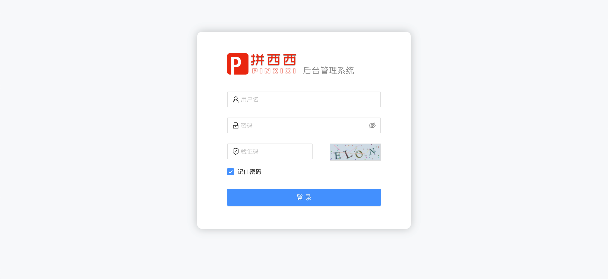

# pinxixi-admin
## 系统简介
拼西西商城后台管理系统，主要基于React16.8及ts相关技术栈开发。商城已实现功能模块有：首页看板、首页管理、商品管理、订单管理、账号管理等。
### 技术栈
+ React（hook）
+ Antd
+ Typescript

<br/>

## 在线体验
+ [后台管理系统](http://119.29.134.117:3001/)（admin / 123456）
+ [H5客户端](http://119.29.134.117:3000/)（pxx / 123456）

<br/>

## 开发
### 安装依赖

```bash
# with npm
npm install
# or with yarn
yarn start
```
### 启动
```bash
# with npm
npm run start
# or with yarn
yarn start
```
### 本地打包
```bash
# with npm
npm run build
# or with yarn
yarn build
```

<br />

## 功能模块

- 用户管理
  - 管理员登录/登出
  - 修改管理员信息
- Dashboard
  - 图表（静态数据，后台TODO）
  - 最新订单
- 首页管理
  - 首页轮播
    - 新增
    - 编辑
    - 上/下架
    - 删除
  - 首页推荐
    - 查询
    - 新增
    - 编辑
    - 删除
- 商品管理
  - 商品列表
    - 查询
    - 新增
    - 编辑
    - 上/下架
    - 删除
  - 商品分类
    - 查询
    - 新增
    - 编辑
    - 删除
- 订单管理
  - 订单列表
    - 订单详情
    - 关闭订单

<br />

## 项目演示(部分)
<div>
  
  
</div>
<div>
  
  
</div>
<div>
  
  
</div>

<br />

## 部署
>使用Jenkins自动化部署到远程服务器。
### Jenkins 执行shell配置
```bash
node -v &&
npm install chromedriver --chromedriver_cdnurl=http://cdn.npm.taobao.org/dist/chromedriver &&
npm install &&
npm run build
```

<br/>

## 设置路径别名

- 在根目录下创建 paths.json 文件，内容如下：

```bash
{
  "compilerOptions": {
    "paths": {
      "@/*": ["./src/*"]
    }
  }
}
```

- 在 tsconfig.json 中配置 extends 引入上面创建的 paths.json 文件

```bash
{
  "compilerOptions":{
    ...

    "extends": "./paths.json"
  }
}
```

<br />

## 问题记录
- the module of react-router-dom should use "require" to import
- ant 的 menu 设置 openKeys 和 defaultOpenKeys 智能二选一，一旦设置了 openKeys，手动展开菜单将会失效，需要结合 onOpenChange 手动控制
- 图片放在 public 里
- 上传组件的 onRemove 回调里要 return false，否则会出现提交表单时图片没有移除，还变成了 file 对象类型的值。(没找到原因...)
- 自定义 hook 里定义的对象类型设置为 any，否则会出现 ts 报错，property xxx does not exits on type xxx
- 富文本组件 RichText 在 onChange 的时候传回父组件的值是 EditorState 类型的对象，需要在表单提交的时候调用 toHTML()转成 HTML。（尝试过在 RichText 组件 onChange 先调用 toHTML()后再传回父组件，但再配合 BraftEditor.createEditorState 时会有其他问题。。。）
